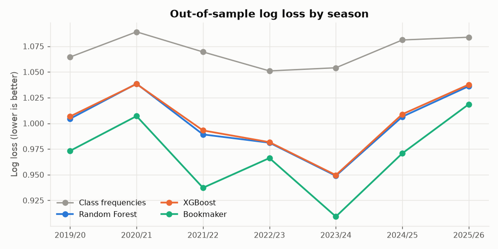

# Premier League Match Outcome Predictor

A reproducible machine-learning pipeline that predicts **Home Win / Draw / Away Win** probabilities for English Premier League matches, using only information that was available before kickoff. It compares a **Random Forest** and an **XGBoost** classifier against simple baselines, evaluated chronologically on seasons the models never saw.

> **Status: Phase 3.** Working so far: the training pipeline (Phase 1); live predictions, the prediction history and the live tracker (Phase 2); and the bookmaker-odds benchmark, betting simulation, EDA and final report (Phase 3). The Streamlit dashboard (Phase 4) is next.
>
> 📄 **[Read the final report](reports/final_report.md)**, a full walkthrough from data collection to simulated betting.

## Problem statement

Given a fixture such as *Liverpool vs Arsenal*, estimate the probability of each outcome. This is a 3-class classification problem with the target encoded as:

| Value | Meaning  |
|------:|----------|
| 0     | Away Win |
| 1     | Draw     |
| 2     | Home Win |

The model trains on **all** Premier League matches in the training period, not just previous meetings of the two clubs. For each historical match, the features describe both teams **as they were before that match kicked off**.

## Architecture

```
Football-Data.co.uk CSVs ─► src/data/collect.py      download + cache in data/raw/
                          ─► src/data/clean.py        normalize names, dates, target; validate
                          ─► src/features/build_features.py   leakage-safe pre-match features
                          ─► src/models/split.py      season-based train / validation / test + walk-forward folds
                          ─► src/models/train_random_forest.py, train_xgboost.py   tuning + fitting
                          ─► src/models/evaluate.py   metrics, baselines, calibration, importance, plots
                          ─► models/  +  reports/model_comparison.md
```

`src/pipeline.py` runs every step end to end.

Live predictions (Phase 2):

```
openfootball fixtures + results ─► src/data/current_season.py   season in progress (Football-Data file preferred when reachable)
historical seasons + current     ─► src/data/update.py           one clean table of every finished match
saved models + that table        ─► src/models/predict.py        fixture features (same code as training) -> RF and XGBoost probabilities
                                 ─► src/tracking/history.py      data/predictions/prediction_history.csv (locked at kickoff)
                                 ─► src/tracking/performance.py  live accuracy, per-class hit rates, accuracy over time
src/live.py: predict | update | report | match
```

Analysis and report (Phase 3):

```
Bet365 odds (football-data.co.uk) ─► src/data/odds.py              join to matches, dates cross-checked
out-of-sample predictions         ─► src/models/benchmark.py       bookmaker implied probabilities scored like a model
                                  ─► src/models/betting.py         $100 flat-stake simulation, ROI with bootstrap CI
                                  ─► src/models/feature_selection.py  walk-forward permutation-importance selection
                                  ─► src/analysis/eda.py           charts
                                  ─► src/final_report.py           reports/final_report.md
```

```
├── config.yaml                 seasons, sources, feature windows, split, tuning budget
├── data/raw/                   cached season CSVs (committed so runs are reproducible)
├── data/processed/             matches.csv, features.csv (generated)
├── data/predictions/           prediction_history.csv (the live forward test)
├── models/                     random_forest.pkl, xgboost.json, model_metadata.json
├── reports/                    final_report.md, model_comparison.md, metrics.json, figures/
├── src/
│   ├── analysis/               eda.py
│   ├── data/                   collect.py, clean.py, current_season.py, update.py, odds.py
│   ├── features/               build_features.py
│   ├── models/                 split.py, tuning.py, train_random_forest.py, train_xgboost.py, evaluate.py,
│   │                           predict.py, benchmark.py, betting.py, feature_selection.py
│   ├── tracking/               history.py, performance.py
│   ├── utils/                  config.py, team_names.py, plotting.py
│   ├── pipeline.py             training
│   ├── live.py                 live predictions and tracking
│   └── final_report.py         benchmark, betting simulation, EDA -> reports/final_report.md
└── tests/                      leakage, feature, cleaning, split and team-name tests
```

## Data source

**[Football-Data.co.uk](https://www.football-data.co.uk/englandm.php)** Premier League season files (`E0.csv`). They are free and stable, with one row per match: date, teams, full-time goals and result, shots, shots on target, corners, fouls and cards.

* **Seasons used:** 2014/15 to 2025/26. 2014/15 only warms up the rolling features, so the first training season doesn't start with empty form. Model rows start in 2015/16. Every season has all 380 matches with no missing shot data.
* **Mirror:** the loader tries the official URL first and falls back to the [`datasets/football-datasets`](https://github.com/datasets/football-datasets) GitHub mirror, which republishes the same E0 files. The CSVs in `data/raw/` came from the mirror because the build environment couldn't reach the official site.
* **Team names** are mapped to one canonical spelling in `src/utils/team_names.py` (for example, `Man United`, `Man Utd` and `Manchester Utd` all become `Manchester United`). An unknown spelling raises an error instead of silently creating a new "team".
* **Season in progress:** football-data.co.uk wasn't reachable from the build environment and the mirror doesn't publish a season until it ends. So fixtures, kickoff times and results for 2026/27 come from [openfootball/football.json](https://github.com/openfootball/football.json). I checked it against all 380 matches of 2025/26 and every score and date matched football-data exactly. openfootball has **goals only, no shots**. When the Football-Data current-season file can be downloaded, it is used instead and cross-checked against openfootball. Each saved prediction records whether shot data was available.
* **Not available:** possession and expected goals aren't in these files. Following the project rule, **possession features are excluded rather than imputed**. A second source such as FBref could add them later; `collect.py` is organized so that another source can be plugged in.

## Features

Every feature is computed from matches that finished **before** the match being described. There are 42 model inputs in total:

| Group | Per team (home_ and away_ versions) |
|---|---|
| Recent form (last 5 matches) | `last5_points`, `last5_goals_scored`, `last5_goals_conceded`, `last5_avg_shots`, `last5_avg_shots_on_target` |
| Season to date | `season_games_played`, `season_points_per_game`, `season_goals_per_game`, `season_goals_conceded_per_game`, `season_goal_difference_per_game`, `season_shots_per_game`, `season_shots_on_target_per_game`, `league_position` |
| Venue form (last 10 home or away matches) | `home_home_points_per_game`, `home_home_win_rate`, `home_home_goals_per_game`, `home_home_goals_conceded_per_game`, and the matching `away_away_*` set |
| Differences (home minus away) | `form_points_diff`, `goal_difference_diff`, `shots_diff`, `shots_on_target_diff`, `season_ppg_diff`, `season_goal_difference_diff`, `league_position_diff`, `venue_ppg_diff` |

Design choices:

* **Home advantage** comes through team-specific home/away records, not a constant `home_advantage = 1` column.
* **Promoted teams:** rolling form restarts when a club returns after at least one season away. Its last Premier League games may be years old and don't describe the current squad. Until it has 5 new matches, its last-5 features are `NaN`.
* **Missing values are left as `NaN`, not filled.** XGBoost and scikit-learn ≥ 1.4 Random Forests route missing values natively, so no arbitrary numbers are invented.
* **No scaling.** Tree models don't need it.
* **League position** for a match on date D is rebuilt from that season's matches played on dates strictly before D, ranked by points, goal difference, then goals scored.
* Extra per-team columns that aren't model inputs yet (wins/draws/losses, win rates, `form_points_per_game`) are kept in `data/processed/features.csv` for later phases.

### Leakage prevention

* All rolling and cumulative statistics are computed after `shift(1)` within each team's own history, so a match never contributes to its own features.
* Season-to-date features use a running total minus the current match, grouped by team and season, so they reset each season and never include later games.
* Goals, shots, the result and the target are listed in `POST_MATCH_COLUMNS` and are never in `feature_columns()`.
* `tests/test_features_leakage.py` checks all of this directly:
  * changing a match's score does not change that match's features, but does change the team's next match;
  * rewriting every match after a cutoff date leaves all earlier features identical;
  * last-5 values equal a hand computation from exactly the previous five matches;
  * season features and league positions reset at each season's opening round;
  * for 25 real matches, features rebuilt from **only earlier history plus the match as an unplayed fixture** equal the training-table features exactly, which is the same path upcoming-fixture predictions will use.

  I also checked the tests themselves: removing `shift(1)`, or including the current match in season totals, makes four of them fail.

## Models

Only the two models the project is about, plus trivial baselines for context:

* **Random Forest:** `sklearn.ensemble.RandomForestClassifier`, tuning `n_estimators`, `max_depth`, `min_samples_split`, `min_samples_leaf`, `max_features` and `class_weight`.
* **XGBoost:** `xgboost.XGBClassifier` with `objective="multi:softprob"` (a probability for each class), tuning `n_estimators`, `max_depth`, `learning_rate`, `subsample`, `colsample_bytree`, `min_child_weight`, `gamma`, `reg_alpha` and `reg_lambda`.
* **Baselines:** *Always Home Win*, and *Class frequencies*, which predicts the training outcome rates for every match. Home Win is the most common outcome in every season, so this also stands in for "always predict the most common outcome", and it has a meaningful log loss.

Hyperparameters come from a small random search (15 RF and 30 XGBoost candidates over sensible ranges), scored by **log loss**, because the goal is good probabilities. The random seed is fixed at 42 in `config.yaml`.

## Validation methodology

Matches are never shuffled across time.

1. **Walk-forward tuning** inside the training seasons: for each season N from 2019/20 to 2023/24, train on every earlier season and validate on N. Hyperparameters are chosen by mean log loss across these five folds.
2. **Validation season 2024/25:** fit on 2015/16–2023/24, compare the models and feature sets.
3. **Test season 2025/26:** refit on 2015/16–2024/25 and evaluate **once**. The test season played no part in any decision. All the test numbers below come from this step.
4. **Production models:** after evaluation, both models are refit with the same hyperparameters on every completed season (2015/16–2025/26) and saved. These are the models that make live predictions, so 2026/27 predictions learn from 2025/26 too.

Metrics: accuracy, macro F1, per-class precision/recall/F1, confusion matrices, log loss, multiclass Brier score, expected calibration error and calibration curves.

## Results (Phase 1)

Full report: [`reports/model_comparison.md`](reports/model_comparison.md). The raw numbers are in `reports/metrics.json`.

**Test season 2025/26** (380 matches, never used for any decision):

| Model | Accuracy | Macro F1 | Log Loss | Brier |
|---|---|---|---|---|
| Always Home Win | 0.426 | 0.199 | n/a | n/a |
| Class frequencies | 0.426 | 0.199 | 1.084 | 0.656 |
| Random Forest | 0.466 | 0.346 | **1.036** | **0.623** |
| XGBoost | **0.474** | **0.351** | 1.038 | 0.624 |

**Validation season 2024/25:** Random Forest 0.529 accuracy / 1.006 log loss, XGBoost 0.537 / 1.009, class-frequency baseline 0.408 / 1.081.

**Walk-forward (2019/20 to 2023/24):** both models beat the baseline in every season, with accuracy 47–58% against 38–48% and log loss 0.95–1.04 against 1.05–1.09.

What this means:

* Both models clearly beat the baselines on every probability metric and on accuracy, in every season tested.
* **The two models are statistically tied.** Random Forest has the lower validation log loss, so it is the selected model. But the paired bootstrap 95% interval for the per-match log-loss gap contains zero on both validation (−0.0075 to +0.0029) and test (−0.0077 to +0.0042). XGBoost is not chosen just because it sounds more advanced.
* 2025/26 was harder to call than 2024/25; the walk-forward folds show similar swings between seasons (2020/21 was also weak).
* Probabilities are well calibrated (expected calibration error 0.03–0.04). Neither model ever makes Draw its top pick, so draw recall is 0.
* The difference features help: adding them improved validation log loss by about 0.01 for both models, so they stay on.
* The most important features, measured by permutation importance on validation, are the season goal-difference gap, the season points-per-game gap, the league-position gap and the home-vs-away venue points gap. Short-term last-5 form matters much less.


### Against the bookmaker, and simulated betting

The strongest benchmark is the betting market itself. Bet365's odds, with the margin removed, score **48.9% accuracy and 1.019 log loss** on the 2025/26 test season, better than both models. The bookmaker has the lower log loss in all seven out-of-sample seasons. On the test season, the models close about three quarters of the log-loss gap between the naive baseline and the bookmaker, but not all of it.

Staking $100 per bet at Bet365's pre-match prices on the test season:

* backing Random Forest's pick in every match loses $4,993 (−13.1% ROI);
* value betting (only when model probability × odds − 1 > 5%) loses $1,565 on 271 bets (−5.8% ROI, 95% CI −26.1% to +15.8%);
* across the five walk-forward seasons, value betting returns −4.8% on 1,407 bets.

So the models learn real signal from public statistics, but not enough to beat a market that already prices that information in. Details, charts and the edge-threshold sensitivity are in the [final report](reports/final_report.md).



## How predictions work

For an upcoming fixture, `src/models/predict.py`:

1. takes every Premier League match finished before the fixture's date, including this season's;
2. builds both teams' features with `features_for_fixtures`, the **same code** that built the training table;
3. checks the columns are exactly the saved models' feature list (stored in `models/model_metadata.json`);
4. runs Random Forest and XGBoost and reports each model's Home/Draw/Away probabilities and whether they agree.

```
Liverpool vs Manchester City  (2026-10-11)

Random Forest
  Liverpool Win:         28.5%
  Draw:                  24.8%
  Manchester City Win:   46.7%
  Predicted: Manchester City Win

XGBoost
  Liverpool Win:         32.1%
  Draw:                  23.2%
  Manchester City Win:   44.7%
  Predicted: Manchester City Win

Models agree
```

The tests prove that features built this way for a known match equal the training-table features, and so do the probabilities.

**Which fixtures get predicted:** those kicking off within the next 14 days (`live.horizon_days`) that are the *next* match for both teams. A team's match after next waits until the match in between has a result.

## Prediction tracking (live forward test)

`python -m src.live predict` saves predictions to [`data/predictions/prediction_history.csv`](data/predictions/prediction_history.csv). The file has the columns requested in the project brief, plus a few for auditability: `prediction_id`, `kickoff`, `round`, `models_agree`, `model_trained_at`, `results_source`, `data_notes`, the actual score and `result_recorded_at`.

Rules that keep the test honest:

* A prediction can only be saved **before kickoff**; trying afterwards raises an error.
* The **first prediction for a fixture stands**. Re-running never changes saved probabilities.
* Filling in results (`python -m src.live update`, also run automatically by `predict`) only writes the actual-result and correct/incorrect columns.
* `data_notes` flags predictions made with incomplete inputs, such as `no_shot_data` or `missing_earlier_result`.
* The CSV is committed to git, so the commit history independently shows when each prediction was made.

`python -m src.live report` shows total predictions, correct predictions and live accuracy per model, log loss and Brier score, the hit rate for each predicted outcome (Home/Draw/Away), how often the models agree, and weekly and cumulative accuracy over time.

**First live predictions:** the 10 matchday 6 fixtures of 2026/27 (10–12 October 2026) were saved on 29 September 2026.

## Installation

```bash
python -m venv .venv
source .venv/bin/activate
pip install -r requirements.txt
```

Python 3.10+ is required. The pipeline was developed on Python 3.11 with scikit-learn 1.9, XGBoost 3.2 and pandas 3.0.

## Usage

```bash
python -m src.pipeline                  # full run: data -> features -> tuning -> evaluation -> saved models (~5 min)
python -m src.pipeline --quick          # 3 tuning candidates per model, for a fast smoke test
python -m src.pipeline --force-download # re-download the season CSVs
python -m pytest                        # run the tests

python -m src.models.feature_selection  # walk-forward feature selection (after the pipeline)
python -m src.final_report              # odds benchmark, betting simulation, EDA -> reports/final_report.md

python -m src.live predict              # refresh data, record results, predict + save upcoming fixtures
python -m src.live predict --dry-run    # show predictions without saving
python -m src.live update               # record results of finished matches
python -m src.live report               # live accuracy so far
python -m src.live match "Liverpool" "Man City" --date 2026-10-11   # one-off prediction, not saved
```

To keep the forward test running, schedule `python -m src.live predict` a couple of times a week (for example with cron) and commit the history file.

To change seasons, windows, the split or the tuning budget, edit `config.yaml`. For example, to load an extra season, lower `history_start_season`/`first_season` and add it to `train_seasons`.

## Limitations

* **Football is noisy.** Draws make up about a quarter of matches and are rarely the single most likely outcome. Both models almost never predict a draw as the top class even though their draw probabilities are sensible, so draw recall is near zero and macro F1 is held down. That's expected, not a bug. Probability-based metrics (log loss, Brier, calibration) are the fairer measure.
* **One test season is a small sample** (380 matches). Accuracy differences of 1–2 points between the models are within noise; the report includes a bootstrap interval on the RF–XGBoost gap.
* **No possession, xG, lineups, injuries or transfers.** Team strength changes within and between seasons in ways these features can't see.
* **The market is ahead.** Bookmaker odds beat both models on log loss in every out-of-sample season, and none of the betting strategies shows a reliable profit. The odds are football-data.co.uk's, republished by [premier-league-data](https://github.com/AnishKhetani/premier-league-data), and they are used only for benchmarking, never as model inputs.
* **Live predictions for 2026/27 have no shot statistics** because the openfootball feed has goals only. Replaying the 2025/26 test season with shot data removed changed log loss from 1.036 to 1.040 (RF) and 1.038 to 1.042 (XGBoost), with no loss of accuracy, so the effect is small but real.
* Early-season rows rely on thin season-to-date statistics.

## Future improvements

* Phase 4: Streamlit dashboard.
* Head-to-head features, rest days, streaks and previous-season finishing position, each kept only if it improves walk-forward log loss.
* A bookmaker-odds baseline from the official Football-Data files.
* SHAP explanations for individual predictions.
* Possibly probability calibration and a draw-aware decision rule if a use case needs hard draw predictions.
