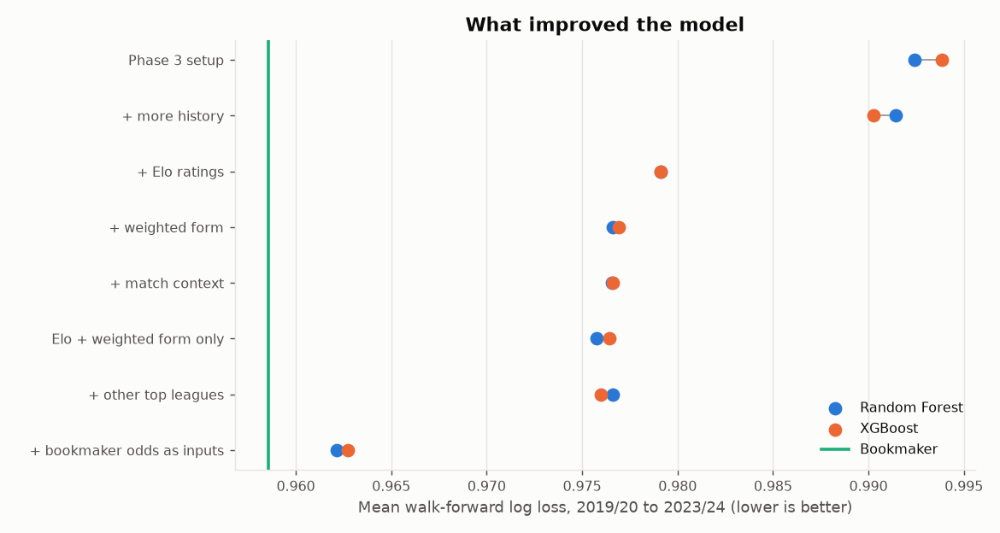

# Improvement experiments

_Generated by `python -m src.experiments`._

Each row is scored on walk-forward seasons 2019/20 to 2023/24: train on every allowed season before N, predict N, average over the five seasons. The validation and test seasons are not used. Hyperparameters are held at Phase 3's values, so differences come from data and features only. Each row after the first adds to the row above unless its note says otherwise.

| Experiment | Features | Trained from | RF log loss | RF accuracy | XGB log loss | XGB accuracy |
| --- | --- | --- | --- | --- | --- | --- |
| Phase 3 setup | 42 | 2015/16 | 0.9924 | 0.5237 | 0.9939 | 0.5263 |
| + more history | 42 | 2005/06 | 0.9914 | 0.5242 | 0.9903 | 0.5284 |
| + Elo ratings | 45 | 2005/06 | 0.9791 | 0.5353 | 0.9791 | 0.5337 |
| + weighted form | 56 | 2005/06 | 0.9766 | 0.5368 | 0.9769 | 0.5326 |
| + match context | 66 | 2005/06 | 0.9765 | 0.5358 | 0.9766 | 0.5358 |
| Elo + weighted form only | 14 | 2005/06 | 0.9757 | 0.5316 | 0.9764 | 0.5321 |
| + other top leagues | 56 | 2005/06 | 0.9766 | 0.5316 | 0.9760 | 0.5305 |
| + bookmaker odds as inputs | 59 | 2005/06 | 0.9621 | 0.5468 | 0.9627 | 0.5495 |
| Bookmaker (Bet365, margin removed) |  |  | 0.9586 | 0.5553 | 0.9586 | 0.5553 |

* **Phase 3 setup**: 42 features, trained from 2015/16
* **+ more history**: same features, trained from 2005/06
* **+ weighted form**: exponentially weighted form incl. shots conceded
* **+ match context**: rest days, unbeaten/winless runs, last season's finish, head-to-head
* **Elo + weighted form only**: the '+ weighted form' setup without the 42 Phase 3 features
* **+ other top leagues**: the '+ weighted form' setup with La Liga, Bundesliga, Serie A and Ligue 1 matches added to training; still scored on the Premier League only
* **+ bookmaker odds as inputs**: the '+ weighted form' setup plus Bet365's implied probabilities; would need live odds for real predictions

## Elo settings

Chosen by the lowest squared error of Elo's expected home score on seasons 2003/04 to 2023/24 (training seasons only): K = 12, home advantage = 60 rating points, 15% pulled back to the mean between seasons.
