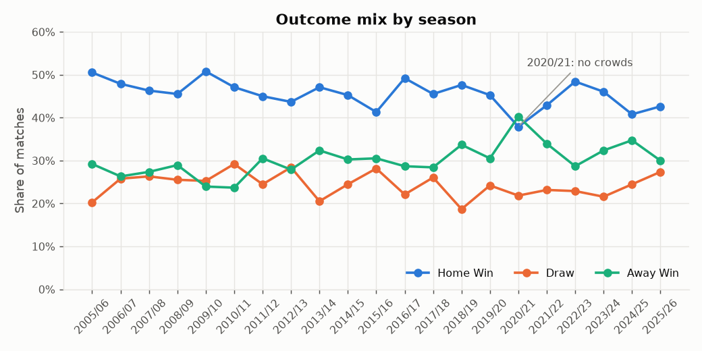
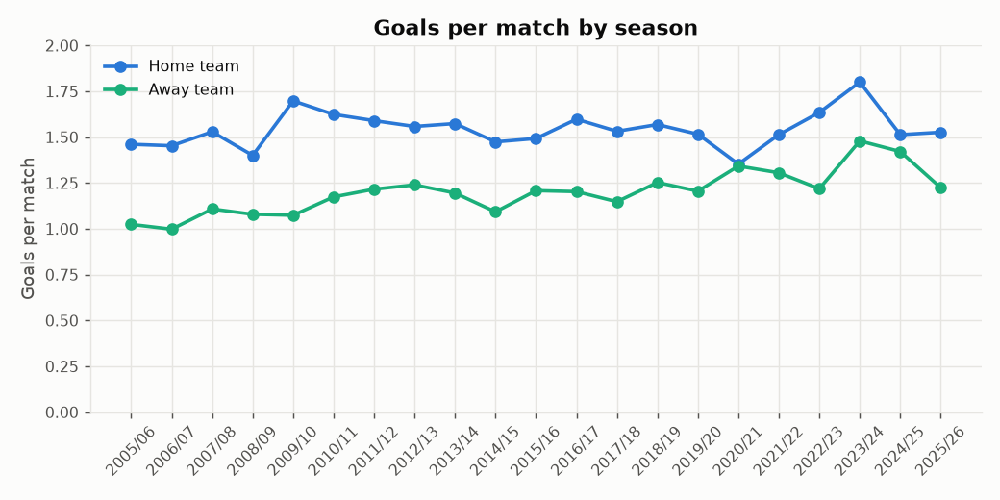
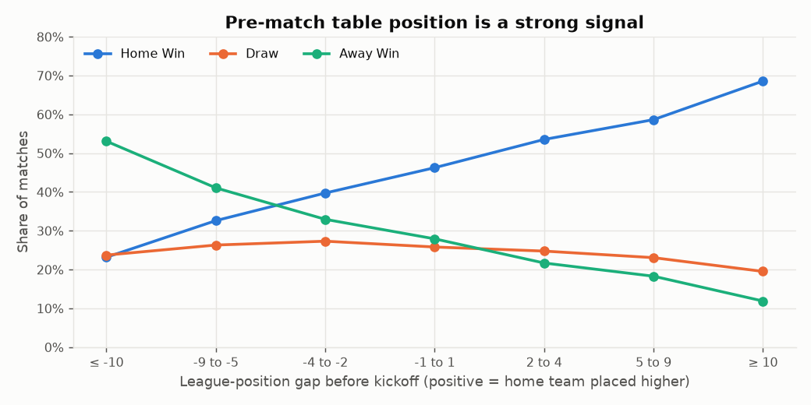
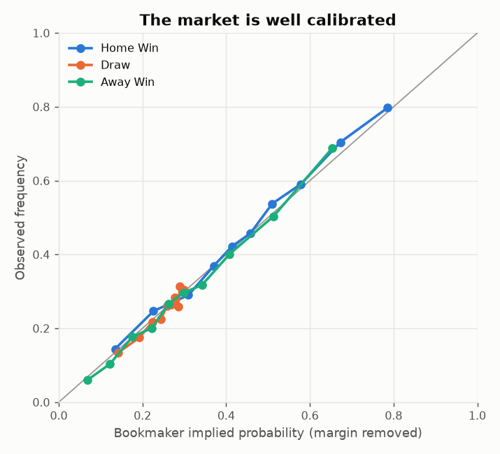
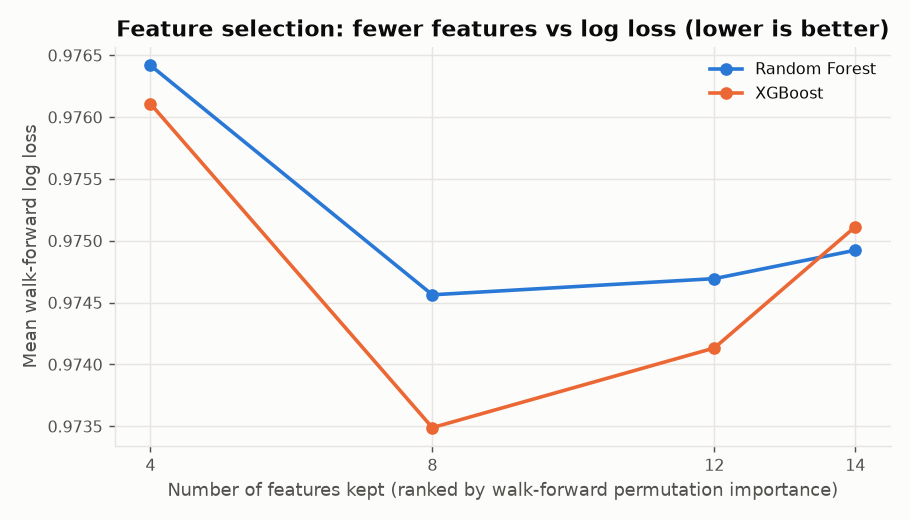
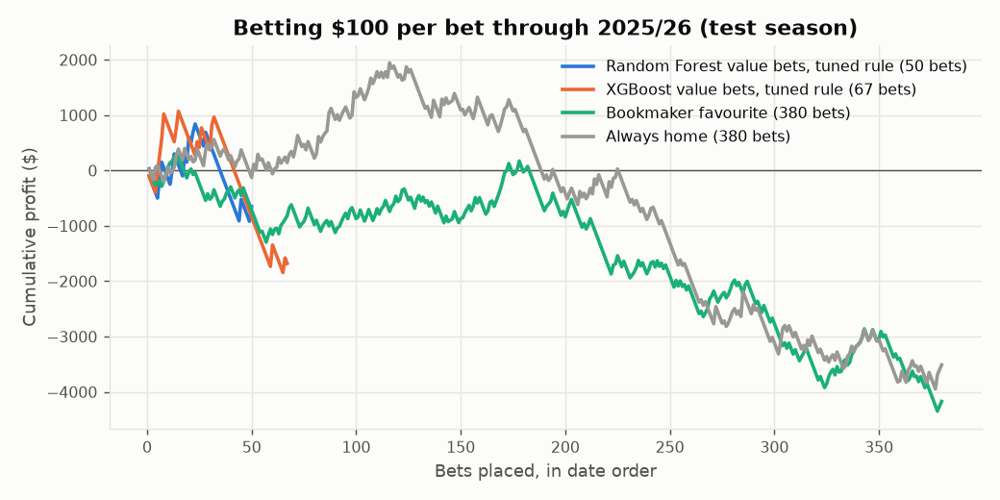

# Predicting Premier League Results with Random Forest and XGBoost

_Final project report, generated by `python -m src.final_report`. Every number below is computed from the pipeline's outputs._

## Summary

* **Task:** predict Home Win / Draw / Away Win probabilities for Premier League matches from information available before kickoff.
* **Data:** 7,980 matches (2005/06–2025/26), 14 leakage-safe features, Bet365 odds for benchmarking.
* **Result on the untouched 2025/26 test season:** Random Forest reached 48.4% accuracy and a log loss of 1.026. Always backing the home team gives 42.6%. The bookmaker's own probabilities score 48.9% and 1.019.
* **Against the market:** the models close 89% of the log-loss gap between a naive baseline and the bookmaker. They are 0.007 log loss behind the bookmaker on the test season. The bookmaker has the lower log loss in all 7 out-of-sample seasons.
* **Simulated betting ($100 flat stakes):** backing Random Forest's pick in every test match gives a loss of $3,952 (-10.4% ROI). Value bets with the fixed 5% edge give a profit of $768 on 216 test bets (3.6%, 95% CI -18.1% to 25.8%) but -24.1% on the validation season. The rule searched on the walk-forward seasons (edge > 30%, best price) returned -13.1% on test and -45.8% on validation. No strategy is reliably profitable.
* **Draws:** plain argmax never predicts a draw (neither does the bookmaker). With the draw rule chosen on past seasons, Random Forest predicts a draw in 19% of test matches and gets 20% of actual draws, at 45.5% overall accuracy (argmax: 48.4%).
* **What improved the model:** Elo ratings, more history and weighted form cut walk-forward log loss from 0.9924 to 0.9757 (bookmaker 0.9586), closing 49% of the gap to the market (section 9).
* **Bottom line:** the models learn real, well-calibrated signal and clearly beat naive baselines, but public team statistics alone don't beat the betting market. That's the expected result for this kind of feature set, and the live forward test will keep checking it honestly.

## 1. Data collection

| Data | Source | Coverage |
| --- | --- | --- |
| Results, shots, shots on target, corners | Football-Data.co.uk E0 files (GitHub mirror `datasets/football-datasets`) | 2000/01–2025/26, 380 matches per season |
| Bet365 pre-match and closing odds, best and average price across bookmakers | Football-Data.co.uk, via `AnishKhetani/premier-league-data` | Bet365 pre-match from 2002/03, best price from 2005/06, closing from 2019/20 |
| Fixtures, kickoff times and results for the season in progress | openfootball `football.json` | goals only, verified against all 380 matches of 2025/26 |

The article this report follows scraped odds from Oddsportal. Here every source is a stable CSV or JSON file, cached in `data/raw/` so the whole project re-runs offline.

## 2. Data cleaning

* Every team spelling is mapped to one canonical name (`Man United`, `Manchester Utd` and `Manchester United FC` all become `Manchester United`), and an unknown name stops the pipeline.
* Dates are parsed format by format, so a day and a month are never swapped. Each result must agree with the recorded score, and duplicate fixtures are rejected.
* The odds are joined by season and teams, and the pipeline stops if a match date disagrees between sources. Every match the models are evaluated on has odds.
* Possession and expected goals aren't in the sources, so they are left out rather than invented.

## 3. Feature engineering

The production models use 14 features that describe both teams as they were **before kickoff**. Phase 3 used 42 form, season-to-date and venue features; the experiments in section 9 showed that Elo ratings and weighted form carry the same information and more, so the models now use those alone. The Phase 3 features are still built and tested:

* **Recent form** (last 5 matches): points, goals scored and conceded, average shots and shots on target.
* **Season to date:** points, goals, goal difference, shots per game, and league position rebuilt from matches played on earlier dates only.
* **Venue form:** the home team's last 10 home matches and the away team's last 10 away matches. This represents home advantage per team instead of as a constant.
* **Differences:** home minus away for form, goal difference, shots, points per game, league position and venue form.

The features the models use:

* **Elo ratings:** one strength number per club that carries across seasons. After every match the winner takes rating points from the loser (K = 12, more for a bigger margin), the home side gets 60 points of advantage, ratings are pulled 15% back to the mean each summer, and a promoted club starts at the average of the clubs that went down. The settings were chosen on training seasons only.
* **Weighted form:** exponentially weighted points, goal difference, shots on target and shots on target conceded, with a half-life of 5 matches, so recent games count most without a hard 5-match cut-off.

All rolling statistics use `shift(1)` within each team's history. The test suite checks this directly: changing a match's score doesn't move its own features, rewriting the future doesn't move past features, and features rebuilt from truncated history equal the training table exactly.

## 4. Exploratory data analysis

Home wins are the most common outcome in 20 of 21 seasons (38%–51% of matches). The exception is 2020/21, when away wins were more common. 2020/21 was played almost entirely without crowds, and home teams won only 38% of matches.

Home teams score 1.54 goals per match on average and away teams 1.20.

Pre-match league position carries a lot of signal. When the home team sits 10 or more places higher, it wins 69% of the time. When it sits 10 or more places lower, it wins only 23%. Draw rates barely move (20%–27%), which is why draws are so hard to predict.

The bookmaker's implied probabilities (with the margin removed) line up closely with how often outcomes actually happen. That's why it's the benchmark to beat.

## 5. Model building

Only two models are compared, as the project brief requires: `RandomForestClassifier` and `XGBClassifier` (`multi:softprob`). Neither needs feature scaling, and both handle missing values (such as a promoted team's empty form) natively.

* **Split:** train 2005/06–2023/24, validate 2024/25, test 2025/26. The test season was used once, at the end.
* **Tuning:** random search (15 Random Forest and 30 XGBoost candidates), scored by mean log loss over walk-forward folds 2019/20–2023/24. Each fold trains on every earlier season.
* **Production:** after evaluation, both models are refit on every completed season for live predictions.

**Walk-forward log loss (best hyperparameters)**

| Season | Class frequencies | Random Forest | XGBoost |
| --- | --- | --- | --- |
| 2019/20 | 1.065 | 0.978 | 0.980 |
| 2020/21 | 1.097 | 1.037 | 1.029 |
| 2021/22 | 1.073 | 0.960 | 0.961 |
| 2022/23 | 1.048 | 0.970 | 0.974 |
| 2023/24 | 1.056 | 0.931 | 0.927 |

**Validation season 2024/25**

| Predictor | Accuracy | Macro F1 | Log Loss | Brier |
| --- | --- | --- | --- | --- |
| Class frequencies | 0.408 | 0.193 | 1.084 | 0.658 |
| Random Forest | 0.513 | 0.383 | 0.989 | 0.590 |
| XGBoost | 0.516 | 0.386 | 0.989 | 0.589 |
| Bookmaker (pre-match) | 0.542 | 0.407 | 0.971 | 0.579 |
| Bookmaker (closing) | 0.553 | 0.415 | 0.968 | 0.576 |

**Test season 2025/26**

| Predictor | Accuracy | Macro F1 | Log Loss | Brier |
| --- | --- | --- | --- | --- |
| Class frequencies | 0.426 | 0.199 | 1.082 | 0.655 |
| Random Forest | 0.484 | 0.358 | 1.026 | 0.617 |
| XGBoost | 0.476 | 0.354 | 1.031 | 0.620 |
| Bookmaker (pre-match) | 0.489 | 0.367 | 1.019 | 0.612 |
| Bookmaker (closing) | 0.492 | 0.369 | 1.013 | 0.608 |

Random Forest and XGBoost are statistically tied. On the test season, the paired bootstrap 95% interval for the per-match log-loss difference (Random Forest minus XGBoost) is -0.0125 to +0.0015. XGBoost was selected on validation log loss. Per class, both models back home wins and away wins but never make a draw the single most likely outcome, so with plain argmax draw recall is 0 (details in [model_comparison.md](model_comparison.md)).

**Getting draws into the predictions.** A draw is almost never the single most likely outcome: draws happen in about a quarter of matches, and in most games one side is a little more likely to win than that. So picking the highest probability (argmax) never picks a draw, and the bookmaker's own prices don't either. The probabilities are fine; the decision rule is the problem. The draw rule predicts a draw when the draw probability reaches a threshold, chosen on the walk-forward seasons to maximise macro F1 (which rewards getting draws right as well as wins).

| Model | Season | Threshold | Accuracy (argmax) | Accuracy (rule) | Macro F1 (argmax) | Macro F1 (rule) | Draws predicted | Draw recall | Draw precision |
| --- | --- | --- | --- | --- | --- | --- | --- | --- | --- |
| Random Forest | 2024/25 | 0.280 | 0.513 | 0.516 | 0.383 | 0.458 | 0.168 | 0.183 | 0.266 |
| Random Forest | 2025/26 | 0.280 | 0.484 | 0.455 | 0.358 | 0.412 | 0.187 | 0.202 | 0.296 |
| XGBoost | 2024/25 | 0.270 | 0.516 | 0.503 | 0.386 | 0.460 | 0.224 | 0.237 | 0.259 |
| XGBoost | 2025/26 | 0.270 | 0.476 | 0.463 | 0.354 | 0.423 | 0.200 | 0.212 | 0.289 |

The rule changes accuracy by -2.9 to +0.3 points and catches about a fifth of the draws. Its draw calls are right 26%–30% of the time, against draw rates of 24%–27% in these seasons, so they are only a little better than guessing: draws stay the hardest outcome to call. Live predictions use the rule for the predicted outcome; the saved probabilities are unchanged.

**What drives Random Forest.** Top 4 features by permutation importance on the validation season: `elo_diff`, `ewm_sot_balance_diff`, `home_elo`, `ewm_goal_diff_diff`.

**What drives XGBoost.** Top 4 features by permutation importance on the validation season: `elo_diff`, `ewm_sot_balance_diff`, `home_elo`, `home_ewm_points`.

**Feature selection.** This is our version of the article's recursive feature elimination. Features are ranked by permutation importance averaged over the walk-forward folds, and the best subset size is chosen by walk-forward log loss. Only the training seasons are used.

| Model | Best k | Validation log loss (selected) | Validation log loss (all) | Top features |
| --- | --- | --- | --- | --- |
| Random Forest | 8 | 0.9905 | 0.9893 | elo_diff, ewm_sot_balance_diff, away_elo, home_elo, ewm_goal_diff_diff … |
| XGBoost | 8 | 0.9895 | 0.9886 | elo_diff, ewm_sot_balance_diff, home_elo, ewm_goal_diff_diff, away_elo … |

Keeping only the top 8 features changes validation log loss by at most 0.0012, which is well within noise. As in the article, a much smaller feature set predicts just as well. The production models keep all 14 features for now; switching to the smaller set is a simplicity choice, not an accuracy one.

## 6. Benchmark: the models against the bookmaker

The bookmaker is scored as if it were another model, using its odds with the margin removed. Log loss is the fairest single measure because it rewards good probabilities, not just correct picks.

| Season | Class frequencies | Random Forest | XGBoost | Bookmaker |
| --- | --- | --- | --- | --- |
| 2019/20 | 1.065 | 0.978 | 0.980 | 0.973 |
| 2020/21 | 1.097 | 1.037 | 1.029 | 1.007 |
| 2021/22 | 1.073 | 0.960 | 0.961 | 0.937 |
| 2022/23 | 1.048 | 0.970 | 0.974 | 0.966 |
| 2023/24 | 1.056 | 0.931 | 0.927 | 0.909 |
| 2024/25 | 1.084 | 0.989 | 0.989 | 0.971 |
| 2025/26 | 1.082 | 1.026 | 1.031 | 1.019 |

On the test season, the models pick the same favourite as the bookmaker in 91% of matches, and their probabilities differ from the market's by 3.9 percentage points on average. The bookmaker's closing line is sharper still (log loss 1.013).

## 7. Simulating investment

As in the reference article, each strategy stakes **$100 per bet**, at Bet365's pre-match odds unless it says best price. Both are prices a bettor could actually have taken.

* **Model pick:** back the model's most likely outcome in every match (the article's approach).
* **Value bets:** back an outcome only when *model probability × odds − 1 > 5%*. This is how a probability model would really be used against a market.
* **Value bets, tuned rule:** the edge threshold, whether to take Bet365's price or the best price listed across bookmakers, and an optional cap on the odds were searched on the walk-forward seasons (2019/20–2023/24) only: Random Forest: edge > 30%, best price (walk-forward ROI 2.8% on 442 bets); XGBoost: edge > 30%, best price (walk-forward ROI 4.6% on 532 bets). Choosing the best of many rules flatters its walk-forward ROI, so the validation and test rows are the ones to believe.
* **Baselines:** always back the home team, and always back the bookmaker's favourite (at Bet365's price and at the best price, which shows how much of the loss is the bookmaker's margin).

**Test season 2025/26**

| Strategy | Bets | Staked | Profit | ROI | ROI 95% CI | Hit rate | Avg odds |
| --- | --- | --- | --- | --- | --- | --- | --- |
| Random Forest model pick | 380 | $38,000 | -$3,952 | -10.4% | -20.2% to -0.4% | 48.4% | 1.96 |
| Random Forest value bets | 216 | $21,600 | +$768 | 3.6% | -18.1% to 25.8% | 32.9% | 3.92 |
| Random Forest value bets, tuned rule | 50 | $5,000 | -$655 | -13.1% | -56.8% to 36.8% | 22.0% | 6.95 |
| XGBoost model pick | 380 | $38,000 | -$4,505 | -11.9% | -21.8% to -1.8% | 47.6% | 1.97 |
| XGBoost value bets | 237 | $23,700 | -$624 | -2.6% | -22.0% to 17.3% | 32.5% | 3.95 |
| XGBoost value bets, tuned rule | 67 | $6,700 | -$1,680 | -25.1% | -62.1% to 15.2% | 17.9% | 6.74 |
| Bookmaker favourite | 380 | $38,000 | -$4,173 | -11.0% | -20.4% to -1.2% | 48.9% | 1.90 |
| Bookmaker favourite, best price | 380 | $38,000 | -$3,389 | -8.9% | -18.6% to 1.1% | 48.9% | 1.95 |
| Always home | 380 | $38,000 | -$3,513 | -9.2% | -21.2% to 2.8% | 42.6% | 2.65 |

**Validation season 2024/25**

| Strategy | Bets | Staked | Profit | ROI | ROI 95% CI | Hit rate | Avg odds |
| --- | --- | --- | --- | --- | --- | --- | --- |
| Random Forest model pick | 380 | $38,000 | -$4,355 | -11.5% | -20.4% to -2.4% | 51.3% | 1.87 |
| Random Forest value bets | 217 | $21,700 | -$5,227 | -24.1% | -43.5% to -3.6% | 24.4% | 4.36 |
| Random Forest value bets, tuned rule | 48 | $4,800 | -$2,196 | -45.8% | -94.6% to 13.9% | 8.3% | 10.12 |
| XGBoost model pick | 380 | $38,000 | -$3,865 | -10.2% | -19.2% to -0.9% | 51.6% | 1.88 |
| XGBoost value bets | 224 | $22,400 | -$4,114 | -18.4% | -39.5% to 5.6% | 25.9% | 4.54 |
| XGBoost value bets, tuned rule | 61 | $6,100 | -$2,354 | -38.6% | -81.5% to 14.7% | 11.5% | 9.90 |
| Bookmaker favourite | 380 | $38,000 | -$1,774 | -4.7% | -13.9% to 4.7% | 54.2% | 1.84 |
| Bookmaker favourite, best price | 380 | $38,000 | -$529 | -1.4% | -11.0% to 8.4% | 54.2% | 1.90 |
| Always home | 380 | $38,000 | -$6,996 | -18.4% | -29.9% to -6.7% | 40.8% | 2.75 |

**Walk-forward seasons 2019/20–2023/24 (pooled)**

| Strategy | Bets | Staked | Profit | ROI | ROI 95% CI | Hit rate | Avg odds |
| --- | --- | --- | --- | --- | --- | --- | --- |
| Random Forest model pick | 1900 | $190,000 | -$13,252 | -7.0% | -11.2% to -2.7% | 53.2% | 1.92 |
| Random Forest value bets | 1177 | $117,700 | -$614 | -0.5% | -12.5% to 11.7% | 26.9% | 5.07 |
| Random Forest value bets, tuned rule | 442 | $44,200 | +$1,218 | 2.8% | -24.4% to 33.8% | 16.5% | 9.59 |
| XGBoost model pick | 1900 | $190,000 | -$13,132 | -6.9% | -11.2% to -2.7% | 53.2% | 1.91 |
| XGBoost value bets | 1315 | $131,500 | -$1,160 | -0.9% | -12.0% to 10.7% | 27.3% | 5.24 |
| XGBoost value bets, tuned rule | 532 | $53,200 | +$2,454 | 4.6% | -19.7% to 31.1% | 16.9% | 9.43 |
| Bookmaker favourite | 1900 | $190,000 | -$5,587 | -2.9% | -7.1% to 1.2% | 55.5% | 1.85 |
| Bookmaker favourite, best price | 1900 | $190,000 | +$3,300 | 1.7% | -2.7% to 6.1% | 55.5% | 1.94 |
| Always home | 1900 | $190,000 | -$7,857 | -4.1% | -10.1% to 2.0% | 44.1% | 2.96 |

**The price matters.** Backing the bookmaker's favourite at Bet365's price returns -2.9% over the walk-forward seasons, -4.7% on validation and -11.0% on test. The same bets at the best price across bookmakers return 1.7%, -1.4% and -8.9%, 2.1 to 4.7 points better. Shopping for the best price helps every strategy, but it doesn't create an edge by itself.

The value bets are mostly on outsiders (average odds 6.95, against 1.90 for the favourite). That's where the models disagree most with the market, and the results show the market is usually right there. This fits the well-documented favourite-longshot bias in betting markets, where bets on outsiders tend to return less than bets on favourites, so apparent value on outsiders is the easiest kind to be fooled by.

**Sensitivity to the edge threshold.** The 5% threshold was fixed before looking at results. These rows show how much the conclusion depends on it:

| Season | Model | Edge threshold | Bets | Profit | ROI |
| --- | --- | --- | --- | --- | --- |
| 2024/25 | Random Forest | 0% | 315 | -$6,970 | -22.1% |
| 2024/25 | Random Forest | 5% | 217 | -$5,227 | -24.1% |
| 2024/25 | Random Forest | 10% | 134 | -$4,016 | -30.0% |
| 2024/25 | Random Forest | 20% | 55 | -$3,680 | -66.9% |
| 2024/25 | XGBoost | 0% | 330 | -$5,242 | -15.9% |
| 2024/25 | XGBoost | 5% | 224 | -$4,114 | -18.4% |
| 2024/25 | XGBoost | 10% | 148 | -$2,708 | -18.3% |
| 2024/25 | XGBoost | 20% | 62 | -$1,547 | -25.0% |
| 2025/26 | Random Forest | 0% | 312 | -$771 | -2.5% |
| 2025/26 | Random Forest | 5% | 216 | +$768 | 3.6% |
| 2025/26 | Random Forest | 10% | 152 | +$1,505 | 9.9% |
| 2025/26 | Random Forest | 20% | 69 | +$651 | 9.4% |
| 2025/26 | XGBoost | 0% | 310 | -$1,400 | -4.5% |
| 2025/26 | XGBoost | 5% | 237 | -$624 | -2.6% |
| 2025/26 | XGBoost | 10% | 163 | +$1,344 | 8.2% |
| 2025/26 | XGBoost | 20% | 82 | -$584 | -7.1% |

How to read this: the bookmaker's margin (5.5% on the test season) means a strategy with no real edge loses roughly that much per bet in the long run. The 95% intervals are wide because one season holds only a few hundred bets. A single profitable season is not evidence of an edge, and a single losing one is not proof there isn't one.

## 8. Productionization

The project runs as a small application rather than a notebook:

* `python -m src.pipeline` rebuilds data, features, models and evaluation reports from scratch.
* `python -m src.live predict` predicts every team's next fixture with both models and saves the predictions to `data/predictions/prediction_history.csv` **before kickoff**. Saved predictions are never overwritten.
* `python -m src.live update` / `report` fill in results and track live accuracy over time.
* Live forward test so far: 10 predictions saved, 0 with results.
* A Streamlit dashboard (Upcoming Predictions, Model Performance, Team Form, Prediction History) is the next phase.

## 9. Improving the model

After Phase 3 each candidate change was scored the same way: mean log loss over the walk-forward seasons 2019/20–2023/24, with the validation and test seasons left untouched and Phase 3's hyperparameters held fixed so only the data and features change. Each row adds to the row above unless its note says otherwise.

| Change | Features | Trained from | RF log loss | RF accuracy | XGB log loss | XGB accuracy |
| --- | --- | --- | --- | --- | --- | --- |
| Phase 3 setup | 42 | 2015/16 | 0.9924 | 0.5237 | 0.9939 | 0.5263 |
| + more history | 42 | 2005/06 | 0.9914 | 0.5242 | 0.9903 | 0.5284 |
| + Elo ratings | 45 | 2005/06 | 0.9791 | 0.5353 | 0.9791 | 0.5337 |
| + weighted form | 56 | 2005/06 | 0.9766 | 0.5368 | 0.9769 | 0.5326 |
| + match context | 66 | 2005/06 | 0.9765 | 0.5358 | 0.9766 | 0.5358 |
| Elo + weighted form only | 14 | 2005/06 | 0.9757 | 0.5316 | 0.9764 | 0.5321 |
| + other top leagues | 56 | 2005/06 | 0.9766 | 0.5316 | 0.9760 | 0.5305 |
| + bookmaker odds as inputs | 59 | 2005/06 | 0.9621 | 0.5468 | 0.9627 | 0.5495 |
| Bookmaker (Bet365, margin removed) |  |  | 0.9586 | 0.5553 | 0.9586 | 0.5553 |

* **Phase 3 setup:** 42 features, trained from 2015/16
* **+ more history:** same features, trained from 2005/06
* **+ weighted form:** exponentially weighted form incl. shots conceded
* **+ match context:** rest days, unbeaten/winless runs, last season's finish, head-to-head
* **Elo + weighted form only:** the '+ weighted form' setup without the 42 Phase 3 features
* **+ other top leagues:** the '+ weighted form' setup with La Liga, Bundesliga, Serie A and Ligue 1 matches added to training; still scored on the Premier League only
* **+ bookmaker odds as inputs:** the '+ weighted form' setup plus Bet365's implied probabilities; would need live odds for real predictions

The production setup is Elo ratings and weighted form only, trained from 2005/06: the best row that can be used for live predictions. With its hyperparameters re-tuned, its walk-forward log loss is 0.9751 for Random Forest. Match context changed log loss by -0.0001, too little to justify ten more features. Adding four more leagues to training left it unchanged, so more data from other leagues does not help an EPL model here. Feeding the bookmaker's odds in as inputs gives 0.9621, still behind the bookmaker, and it can't be used live without an odds feed for upcoming fixtures.

## 10. Why some projects report 60–70% accuracy

Public football-prediction projects sometimes report around 70% accuracy with the same algorithms. One example is [stogaja/Football-Match-Outcome-Predictor](https://github.com/stogaja/Football-Match-Outcome-Predictor). Its inputs are the half-time score plus the full-match shots, shots on target and red cards of the match being predicted, scored on a random 80/20 split. It predicts at half-time with second-half statistics already known, so none of its inputs exist before kickoff.

Rerunning that setup on our data (2009/10 to 2018/19, 3,800 matches):

| Inputs | Random Forest | Logistic regression |
| --- | --- | --- |
| Their inputs: team ids, half-time score, same-match shots, shots on target, red cards | 0.639 | 0.674 |
| Half-time score only | 0.607 | 0.633 |
| Same-match shots on target and red cards only | 0.532 | 0.570 |
| Team ids only (the only pre-match information in their inputs) | 0.484 | 0.464 |

The half-time score alone gets 61%. With only the team identities, the one pre-match input in that set, accuracy drops to 48%. A pre-match model should be compared with the bookmaker instead, whose own favourite wins 49% of the time on the test season. That's the realistic ceiling here.

## 11. Next steps

* **Richer inputs:** expected goals, lineups, injuries and transfers aren't in these sources, and they are what the bookmaker prices in.
* **Current-season shots:** the live feed has goals only. Allowing football-data.co.uk in the network settings would restore shot statistics (the replayed test season lost about 0.004 log loss without them).
* **Live odds:** the odds-as-inputs variant needs pre-match odds for upcoming fixtures, which the current sources don't provide.
* **Explanations:** SHAP values (XGBoost supports them natively) to say why a team is favoured.

## 12. Conclusion

Using only public match statistics, both tree models beat the naive baseline in every out-of-sample season. They produce well-calibrated probabilities and reach about 48% accuracy on the test season (51% on validation), in a three-way problem where a quarter of matches are draws. Random Forest and XGBoost are indistinguishable within statistical noise.

The bookmaker remains ahead (1.019 vs 1.026 log loss on the test season). Value betting returned 3.6% (fixed 5% edge) and -13.1% (rule chosen on past seasons) on the test season, and -24.1% and -45.8% on the validation season. A negative return is not a bug in the simulation: the bookmaker's margin is built into every price, so a model that is slightly less accurate than the market loses money on average. The honest conclusion is the one the reference article's title hints at but can't claim from a single season: beating the odds needs information the market doesn't already have. The live forward test will show whether this verdict holds on matches that haven't happened yet.
