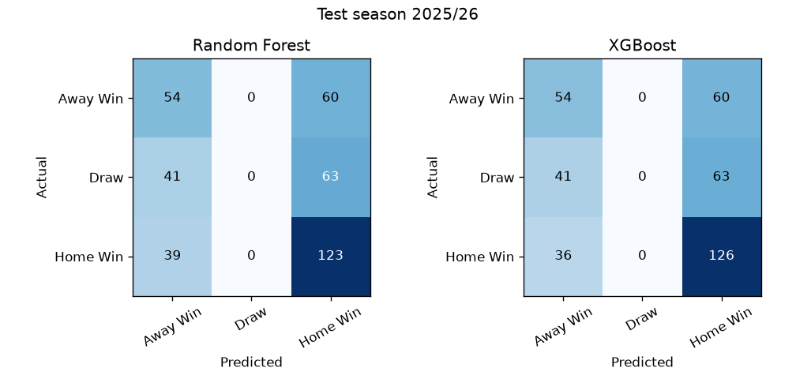
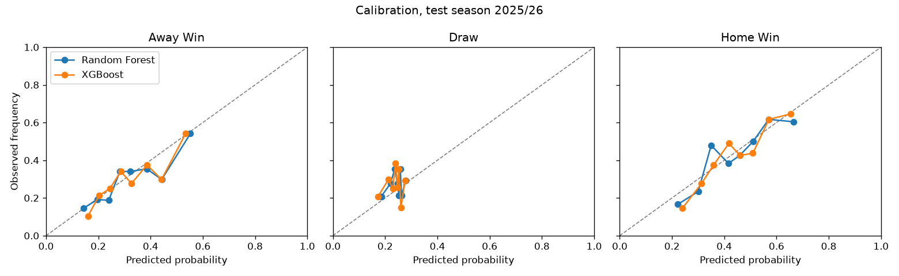
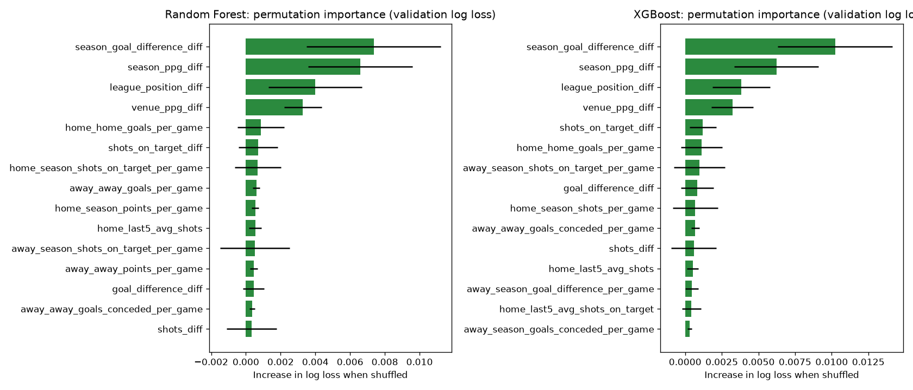

# Phase 1 model comparison

_Generated by `python -m src.pipeline`._

## Data

* 4560 Premier League matches loaded (2014/15 to 2025/26); the first season only warms up rolling features.
* 4180 model rows. Train 3420 (2015/16 to 2023/24), validation 380 (2024/25), test 380 (2025/26).
* Training outcome mix: Home 44.9%, Draw 23.2%, Away 31.9%.
* 42 features. No possession or xG (not in the source data).

## Walk-forward validation (inside training seasons, best hyperparameters)

Each row trains on every earlier training season and predicts the named season.

| Validated on | Class frequencies accuracy | Class frequencies log loss | Random Forest accuracy | Random Forest log loss | XGBoost accuracy | XGBoost log loss |
| --- | --- | --- | --- | --- | --- | --- |
| 2019/20 | 0.453 | 1.065 | 0.497 | 1.004 | 0.500 | 1.007 |
| 2020/21 | 0.379 | 1.089 | 0.466 | 1.039 | 0.471 | 1.038 |
| 2021/22 | 0.429 | 1.069 | 0.534 | 0.989 | 0.537 | 0.993 |
| 2022/23 | 0.484 | 1.051 | 0.545 | 0.981 | 0.545 | 0.982 |
| 2023/24 | 0.461 | 1.054 | 0.576 | 0.949 | 0.579 | 0.950 |

## Validation season 2024/25 (models fit on 2015/16 to 2023/24)

| Model | Accuracy | Macro F1 | Log Loss | Brier | Draw recall |
| --- | --- | --- | --- | --- | --- |
| Always Home Win | 0.408 | 0.193 | n/a | n/a | 0.000 |
| Class frequencies | 0.408 | 0.193 | 1.081 | 0.656 | 0.000 |
| Random Forest | 0.529 | 0.396 | 1.006 | 0.602 | 0.000 |
| XGBoost | 0.537 | 0.401 | 1.009 | 0.603 | 0.000 |

### Model selection

Selected by validation log loss: **Random Forest**. Random Forest minus XGBoost log loss per match: validation -0.0024 (95% CI -0.0075 to +0.0029), test -0.0016 (95% CI -0.0077 to +0.0042). An interval that contains 0 means one season is not enough to separate the two models.

### Feature-set ablation on validation

| Model | Features | Accuracy | Macro F1 | Log Loss |
| --- | --- | --- | --- | --- |
| Random Forest | individual only (34) | 0.513 | 0.383 | 1.019 |
| XGBoost | individual only (34) | 0.511 | 0.378 | 1.018 |
| Random Forest | individual + diffs (42) | 0.529 | 0.396 | 1.006 |
| XGBoost | individual + diffs (42) | 0.537 | 0.401 | 1.009 |

## Test season 2025/26 (models refit on 2015/16 to 2023/24 + 2024/25)

The test season was not used for any modelling decision.

| Model | Accuracy | Macro F1 | Log Loss | Brier | Draw recall |
| --- | --- | --- | --- | --- | --- |
| Always Home Win | 0.426 | 0.199 | n/a | n/a | 0.000 |
| Class frequencies | 0.426 | 0.199 | 1.084 | 0.656 | 0.000 |
| Random Forest | 0.466 | 0.346 | 1.036 | 0.623 | 0.000 |
| XGBoost | 0.474 | 0.351 | 1.038 | 0.624 | 0.000 |

### Per-class performance (test)

| Model | Class | Precision | Recall | F1 | Support | Predicted share |
| --- | --- | --- | --- | --- | --- | --- |
| Random Forest | Away Win | 0.403 | 0.474 | 0.435 | 114 | 0.353 |
| Random Forest | Draw | 0.000 | 0.000 | 0.000 | 104 | 0.000 |
| Random Forest | Home Win | 0.500 | 0.759 | 0.603 | 162 | 0.647 |
| XGBoost | Away Win | 0.412 | 0.474 | 0.441 | 114 | 0.345 |
| XGBoost | Draw | 0.000 | 0.000 | 0.000 | 104 | 0.000 |
| XGBoost | Home Win | 0.506 | 0.778 | 0.613 | 162 | 0.655 |

### Confusion matrices (test)

**Random Forest**

|  | Pred Away Win | Pred Draw | Pred Home Win |
| --- | --- | --- | --- |
| Actual Away Win | 54 | 0 | 60 |
| Actual Draw | 41 | 0 | 63 |
| Actual Home Win | 39 | 0 | 123 |

**XGBoost**

|  | Pred Away Win | Pred Draw | Pred Home Win |
| --- | --- | --- | --- |
| Actual Away Win | 54 | 0 | 60 |
| Actual Draw | 41 | 0 | 63 |
| Actual Home Win | 36 | 0 | 126 |



### Probability quality (test)

Brier is the multiclass Brier score (lower is better). ECE is the expected calibration error of the predicted class's probability.

| Model | Log Loss | Brier | ECE |
| --- | --- | --- | --- |
| Class frequencies | 1.084 | 0.656 | 0.019 |
| Random Forest | 1.036 | 0.623 | 0.039 |
| XGBoost | 1.038 | 0.624 | 0.026 |



## Feature importance (validation season 2024/25)

Permutation importance: how much validation log loss rises when a feature is shuffled. Built-in rank is the model's own impurity/gain ranking, shown for comparison.

**Random Forest**

| Feature | Log-loss increase | Built-in rank | Std |
| --- | --- | --- | --- |
| season_goal_difference_diff | 0.0074 | 1 | 0.0039 |
| season_ppg_diff | 0.0066 | 2 | 0.0030 |
| league_position_diff | 0.0040 | 3 | 0.0027 |
| venue_ppg_diff | 0.0033 | 4 | 0.0011 |
| home_home_goals_per_game | 0.0009 | 12 | 0.0013 |
| shots_on_target_diff | 0.0007 | 9 | 0.0011 |
| home_season_shots_on_target_per_game | 0.0007 | 8 | 0.0013 |
| away_away_goals_per_game | 0.0006 | 28 | 0.0002 |
| home_season_points_per_game | 0.0005 | 26 | 0.0002 |
| home_last5_avg_shots | 0.0005 | 23 | 0.0004 |

**XGBoost**

| Feature | Log-loss increase | Built-in rank | Std |
| --- | --- | --- | --- |
| season_goal_difference_diff | 0.0102 | 3 | 0.0039 |
| season_ppg_diff | 0.0062 | 2 | 0.0029 |
| league_position_diff | 0.0038 | 1 | 0.0020 |
| venue_ppg_diff | 0.0032 | 5 | 0.0014 |
| shots_on_target_diff | 0.0012 | 8 | 0.0009 |
| home_home_goals_per_game | 0.0011 | 15 | 0.0014 |
| away_season_shots_on_target_per_game | 0.0010 | 6 | 0.0018 |
| goal_difference_diff | 0.0008 | 9 | 0.0011 |
| home_season_shots_per_game | 0.0007 | 10 | 0.0015 |
| away_away_goals_conceded_per_game | 0.0007 | 28 | 0.0003 |




## Hyperparameters chosen by walk-forward log loss

```json
{
  "Random Forest": {
    "n_estimators": 500,
    "min_samples_split": 10,
    "min_samples_leaf": 20,
    "max_features": 0.3,
    "max_depth": 4,
    "class_weight": null
  },
  "XGBoost": {
    "subsample": 0.6,
    "reg_lambda": 1.0,
    "reg_alpha": 0,
    "n_estimators": 300,
    "min_child_weight": 10,
    "max_depth": 2,
    "learning_rate": 0.01,
    "gamma": 0,
    "colsample_bytree": 0.5
  }
}
```
